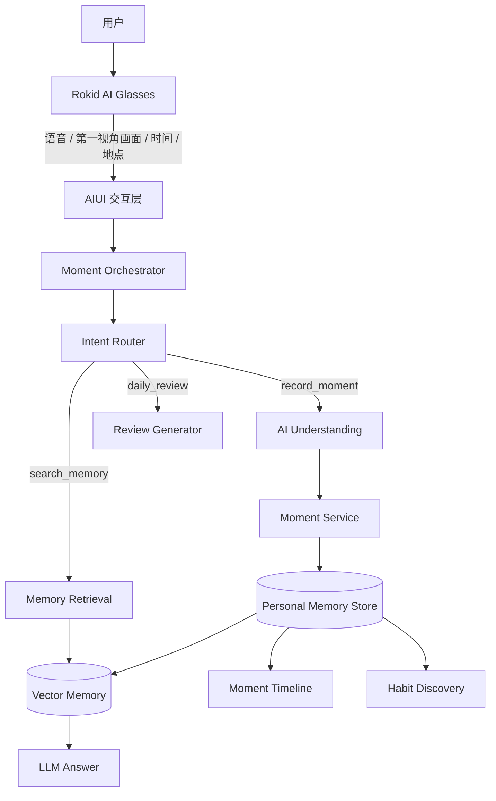
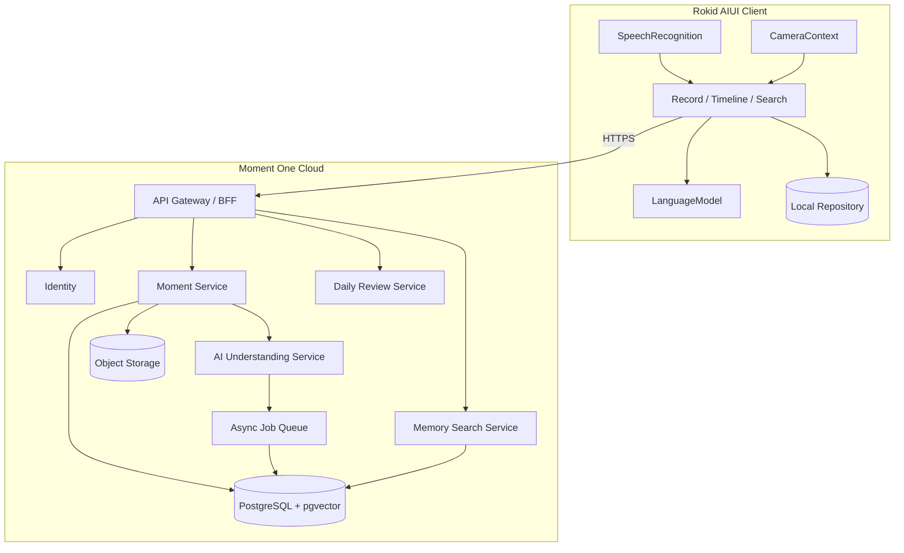

# 一刻 YiKe · Moment One 架构设计

> 产品定位：面向 Rokid AI Glasses 的 AI 原生个人生活记忆系统。  
> Slogan：AI 替你记住人生。

## 1. 产品架构



### 1.1 核心产品原则

1. 所有生活记录统一为 `Moment`，不创建旅行、美食、日记等割裂模块。
2. 用户输入最少化：一次唤醒、一次表达，系统完成采集和结构化。
3. AI 分类是默认行为，但结果必须可纠正、可追溯。
4. 第一视角画面与语音具有同等重要性。
5. 搜索回答必须能回指作为证据的 Moment。
6. 端侧具备离线降级能力，云端负责长期存储、跨设备同步和高质量 RAG。

### 1.2 Moment 生命周期

```text
CAPTURED → UNDERSTANDING → READY → EMBEDDED → ARCHIVED
                │
                └──────────────→ NEEDS_REVIEW
```

- `CAPTURED`：采集到语音、画面及设备上下文。
- `UNDERSTANDING`：AI 正在生成标题、分类、标签与摘要。
- `READY`：Moment 可在时间线展示。
- `EMBEDDED`：已进入向量检索索引。
- `NEEDS_REVIEW`：模型置信度低或关键字段冲突。

## 2. 技术架构



### 2.1 客户端职责

- 处理语音唤醒、语音识别、第一视角拍照和即时反馈。
- 在宿主支持时调用 `LanguageModel` 完成端侧多模态理解。
- 网络不可用时保存本地 Moment，并在恢复后同步。
- 不承担长期向量索引、跨用户权限或大型媒体持久化。

### 2.2 云端职责

- 统一认证、数据持久化、媒体管理、模型调用与检索。
- 通过异步任务生成 embedding、每日回顾和习惯候选。
- 保存模型版本、Prompt 版本、置信度及证据链。

### 2.3 MVP Repository 边界

AIUI 页面只依赖以下抽象：

```ts
interface MomentRepository {
  save(moment: Moment): Promise<Moment>;
  list(filter?: MomentFilter): Promise<Moment[]>;
  search(query: string, limit?: number): Promise<Moment[]>;
  get(id: string): Promise<Moment | null>;
}
```

当前实现为 `wx` 本地存储；云端接入后可替换为 HTTP Repository。

## 3. 数据模型

### 3.1 Moment 领域对象

```ts
type MomentCategory =
  | 'experience'
  | 'habit'
  | 'travel'
  | 'food'
  | 'growth'
  | 'emotion';

interface Moment {
  id: string;
  userId: string;
  title: string;
  occurredAt: string;
  timezone: string;
  location: {
    name?: string;
    latitude?: number;
    longitude?: number;
    source: 'device' | 'user' | 'ai' | 'unknown';
  };
  media: Array<{
    id: string;
    type: 'image' | 'video' | 'audio';
    mimeType: string;
    url?: string;
    localDataUrl?: string;
  }>;
  voiceInput: string;
  description: string;
  category: MomentCategory;
  tags: string[];
  emotion: {
    label: string;
    valence?: number;
    arousal?: number;
  };
  aiSummary: string;
  confidence: number;
  metadata: Record<string, unknown>;
  createdAt: string;
  updatedAt: string;
}
```

数据库 DDL 见 [`database/schema.sql`](./database/schema.sql)。

## 4. API 设计

完整契约见 [`api/openapi.yaml`](./api/openapi.yaml)。

| Method | Path | 作用 |
|---|---|---|
| POST | `/v1/moments` | 创建并理解 Moment |
| GET | `/v1/moments` | 获取时间线，支持游标和过滤 |
| GET | `/v1/moments/{momentId}` | 获取单个 Moment |
| PATCH | `/v1/moments/{momentId}` | 用户纠正 AI 结构化结果 |
| DELETE | `/v1/moments/{momentId}` | 软删除 Moment |
| POST | `/v1/memory/search` | 自然语言记忆查询 |
| POST | `/v1/reviews/daily` | 生成每日回顾 |
| POST | `/v1/media/presign` | 获取媒体上传凭证 |

### 4.1 创建 Moment 流程

```text
Client capture
  → media upload
  → POST /v1/moments
  → store raw context
  → multimodal understanding
  → persist structured Moment
  → enqueue embedding
  → return Moment
```

### 4.2 搜索流程

```text
Question
  → intent/filter extraction
  → query embedding
  → metadata filtering + vector retrieval
  → reranking
  → evidence-bound generation
  → answer + evidenceMomentIds
```

## 5. AI Agent 设计

### 5.1 Intent

| Intent | 描述 | MVP |
|---|---|---|
| `record_moment` | 采集并生成 Moment | 是 |
| `search_memory` | 查询个人记忆 | 是 |
| `generate_summary` | 生成单条或集合摘要 | 是 |
| `create_habit` | 将行为候选转成习惯 | 否 |
| `daily_review` | 生成每日回顾 | 否 |

### 5.2 Prompt 分层

1. **System Prompt**：身份、事实边界、安全规则、输出契约。
2. **Task Prompt**：当前意图的结构化要求。
3. **Context**：时间、地点、语音、画面、候选 Moment。
4. **Output Validator**：JSON 解析、枚举校验、长度裁剪、默认值。
5. **Fallback Classifier**：模型不可用时的确定性降级。

Prompt 见 [`../prompts/moment-understanding.md`](../prompts/moment-understanding.md)。

## 6. 非功能要求

- **隐私**：默认私有；原始媒体与派生向量均属于用户数据。
- **可删除**：删除 Moment 时同步删除媒体、embedding 与派生回顾引用。
- **可解释**：搜索回答返回 `evidenceMomentIds`。
- **延迟目标**：端侧状态反馈小于 300ms；Moment 生成 P95 小于 8s。
- **离线优先**：采集不能因为模型或网络不可用而失败。
- **幂等性**：创建接口接受 `Idempotency-Key`，避免眼镜端重试产生重复记忆。
- **观测性**：记录 request ID、模型版本、Prompt 版本、耗时和降级原因。
